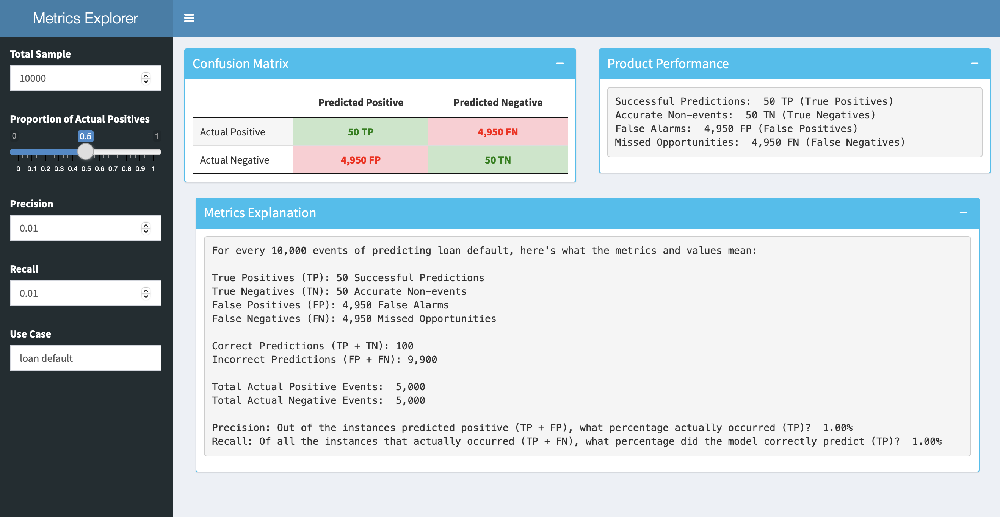

# 📊 Precision-Recall Explorer for Business

## Unveiling the Dynamics of Precision and Recall

Welcome to the Metrics Explorer – an interactive Shiny app designed to demystify the world of precision and recall for business stakeholders. Explore it [here.](https://tiger-tang.shinyapps.io/MetricsExplorer/)

### Key Features

1. **Confusion Matrix Playground:**
   - Visualize the interplay between precision and recall on a dynamic confusion matrix.
   - Explore the impact of tweaking these metrics on True Positives, True Negatives, False Positives, and False Negatives.

2. **Performance Breakdown:**
   - Get a closer look at your model's performance with key metrics:
     - Successful Predictions (True Positives) – the wins.
     - Accurate Non-events (True Negatives) – the silent guardians.
     - False Alarms (False Positives) – the surprises.
     - Missed Opportunities (False Negatives) – the near-misses.

3. **Metrics in Plain Language:**
   - Understand the metrics in business terms:
     - True Positives (TP): Successful Predictions.
     - True Negatives (TN): Accurate Non-events.
     - False Positives (FP): False Alarms.
     - False Negatives (FN): Missed Opportunities.

### Your Business, Your Story

- **Tailored Scenarios:** Customize discussions to fit your business context.
- **Use Case Integration:** Whether it's loan default prediction or customer churn, see how precision and recall play out in your unique scenario.

### How to Use

1. **Clone or Download:**
   - Clone the repository or download the ZIP file to get started.

2. **Run Locally:**
   - Open the Shiny app in RStudio or your preferred environment.
   
3. **Interact and Learn:**
   - Adjust the sliders for total sample, proportion of actual positives, precision, and recall.
   - Witness how changes impact the confusion matrix and key performance metrics.

### Why Metrics Explorer?

Data Science often hits a "communication wall" when explaining model thresholds. This app breaks that wall by:
- **Translating Jargon:** Replaces TP/FP/TN/FN with business-friendly terms like "Wins" and "Surprises."
- **Interactive Simulation:** Let stakeholders "feel" the trade-off by moving sliders for precision and recall.
- **Contextual Discussion:** Ideal for "What-If" sessions regarding loan defaults, medical screening, or customer churn.

### Contribute

- **Issues and Contributions:** If you find a bug or have an idea for improvement, open an issue or submit a pull request.

### License

This project is licensed GNU GENERAL PUBLIC LICENSE.

